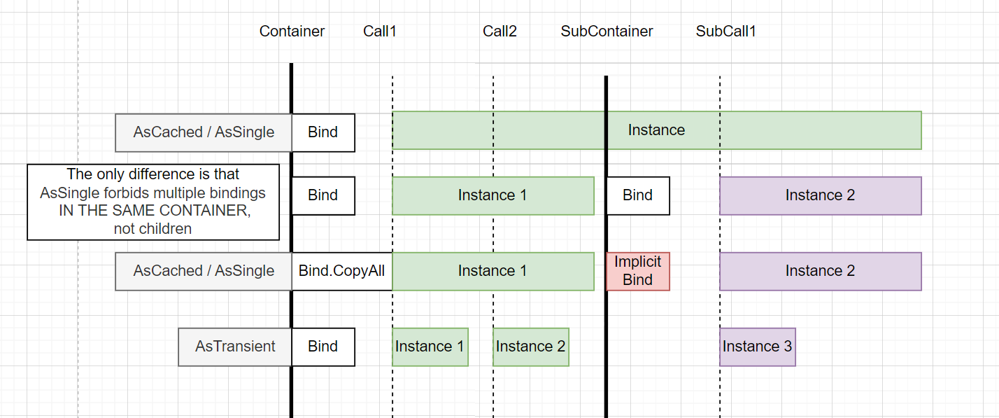

AsSingle and AsCached can be overriden in sub containers. And will be overridden in case of AsCached.
Seemingly the only difference between them is limited to same container and AsSingle forbids multiple instances of same type, regardless of order of usage, while AsCached - does not.

CopyIntoAllSubcontainers will basically make an implicit binding into created subcontainers.